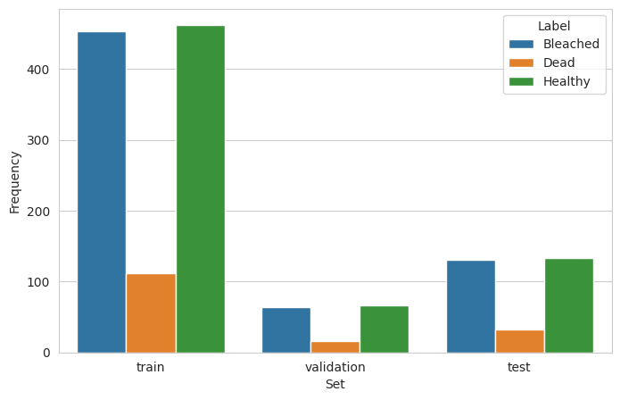

# CORALS HEALTH


[Image source](https://www.anses.fr/en/content/coral-reefs-french-overseas-territories)

#### INTRODUCTION

Welcome to the "Coral's Health" ML project. This project was inspired by several visits of the author to the Great Barrier Reef (Australia) and observations of detrimental effect (a.k.a. bleaching) of human activity on various colonies of corals. The aim of the project:<br>
* Using an available pre-labelled dataset (suitable for supervised ML) of images of 'Healthy', 'Bleached' and 'Dead' coral colonies, build and train ML model (or models) for the automated prediction of the state of health of unseen coral(s).

This goal will be achieved via addressing two business objectives:
1. Compare average images of different labels ('Healthy', 'Bleached', 'Dead', in pairs) (data visualisation task), and
2. Develop and train ML model which would predict the group to which an unseen picture belongs (ML categorisation task).
<hr>


## Table of Contents

### [I. CRISP-DM Methodology](#crisp-dm-methodology)
* [1. Business Understanding](#business-understanding)
* [2. Data Understanding](#data-understanding)
* [3. Data Preparation](#data-preparation)
* [4. Modelling](#modelling)
* [5. Evaluation](#evaluation)
* [6. Deployment](#deployment)

### [II. ML Pipeline](#ii-ml-pipeline-1)
* [1. Data Collection](#data-collection)
* [2. Exploratory Data Analysis (EDA)](#exploratory-data-analysis)
* [3. Feature Engineering](#feature-engineering)
* [4. Model Building](#model-building)
* [5. Model Evaluation](#model-evaluation)


### [III. Jupyter Notebooks](#iii-jupyter-notebooks-1)
* [1. Notebook Structure](#notebook-structure)
* [2. Results and Visualisation](#results-and-visualisation)


### [IV. Streamlit Dashboard](#iv-streamlit-dashboard-1)
* [1. Overview](#overview)
* [2. Installation and Setup](#installation-and-setup)
* [3. Backend Code: Features and Validation](#backend-code-features-and-validation)
* [4. Dashboard Features](#dashboard-features)
* [5. User Guide](#user-guide)

### [V. Conclusions and Future Work](#v-conclusions-and-future-work-1)

### [VI. Dependencies and Requirements](#dependencies-and-requirements)

### [VII. How to Run the Project](#how-to-run-the-project)

### [VIII. Data Analysis and Machine Learning Libraries](#data-analysis-and-machine-learning-libraries)

### [IX. Deployment](#deployment-1)

### [X. Bugs](#bugs)

### [XI. Maintenance](#maintenance)

#### [Credits](#credits-1)

#### [Acknowledgements](#acknowledgements-1)

#### [Contact information](#contact-information-1)

#### [References](#references-1)

#### [Comments](#comments-1)
<hr>
<hr>

### CRISP-DM Methodology

#### Business Understanding
Coral bleaching is the process when corals become white due to loss of symbiotic algae and photosynthetic pigments. This loss of pigment can be caused by various stressors, such as changes in ocean temperature (due to Global Warming), light, or nutrients. Bleaching occurs when coral polyps expel the zooxanthellae (dinoflagellates that are commonly referred to as algae) that live inside their tissue, causing the coral to turn white. The zooxanthellae are photosynthetic, and as the water temperature rises, they begin to produce reactive oxygen species. This is toxic to the coral, so the coral expels the zooxanthellae. Since the zooxanthellae produce the majority of coral colouration, the coral tissue becomes transparent, revealing the coral skeleton made of calcium carbonate. Most bleached corals appear bright white, but some are blue, yellow, or pink due to pigment proteins in the coral. According to the United Nations Environment Programme, between 2014 and 2016, the longest recorded global bleaching events killed coral on an unprecedented scale. In 2016, bleaching of coral on the Great Barrier Reef killed 29 to 50 percent of the reef's coral. In 2017, the bleaching extended into the central region of the reef. The average interval between bleaching events has halved between 1980 and 2016, [Wikipedia article](https://en.wikipedia.org/wiki/Coral_bleaching).
<br>
<br>
<u>The project has two business requirements:</u><br>
<hr>
<b>1. - The client is interested in having a capability to compare average images obtained for 'healthy', 'bleached' and 'dead' corals and check if these groups can be visually unambiguously categorised.</b>
<hr>
<b>2. - Answer (by using a trained ML model) if an uploaded (previously unseen) image was taken for a 'Healthy', 'Bleached' or 'Dead' coral.</b>
<hr>

**In this project, probability of prediction higher than 50 % will be used as a threshold  value and will be considered as statistically significant.**

* Rationale to map the business requirements to the Data Visualisations and ML tasks:<br>

Addressing these requirements sucessfully will:
1. Reduce an amount of tedious/repetitive work
2. Reduce involvement of an operator/technician and therefore minimize a human error, and
3. will help with the task to a visually-impaired user. For instance, color-blindeness can make a task of manual sorting of images quite challenging.


#### Data Understanding
Several datasets from [Kaggle](https://www.kaggle.com) were reviewed, primarily containing images labeled as 'Healthy' and 'Bleached'. However, to address the three-category classification ('Healthy', 'Bleached', 'Dead'), the [BHD Corals dataset](https://www.kaggle.com/datasets/sonainjamil/bhd-corals) with 1,572 labeled images was selected. Initial analysis indicated potential labeling inconsistencies, necessitating further data preparation. It was observed in particular that 'Bleached' corals group partially encompasses two subgroups: 'Bleached' and 'Dead'. The aim of the project and the idea of the author was to check if a ML model (or models) can be extended and trained to enable categorical classification of images of corals into these **three** groups ('Bleached', 'Healthy' and 'Dead') rather than just **two** ('Healthy' and 'Bleached'). The datasets where coral images would be pre-labelled according to those three categories are much more scarce. This dataset was selected therefore despite some cross contamination which author was challenged to accommodate. The images in the selected dataset were preprocessed by the owner of dataset to have identical 227 x 227 dimension. Data preparation included: (i) cleaning, and (ii) augmentation.

#### Data Preparation
Data preparation involved cleaning the dataset by removing non-image files and grayscale images, followed by manual verification to correct mislabeled entries. Due to the limited number of images, data augmentation techniques were applied to enhance the dataset's diversity and improve model generalisation.

#### Modelling
Convolutional Neural Networks (CNNs) were employed to classify coral images into three categories. Three models of increasing complexity were developed to mitigate overfitting and enhance generalisation. Techniques such as dropout layers and data augmentation were utilized to improve model performance.

#### Evaluation
Models were evaluated based on accuracy and loss metrics using validation and test datasets. The evaluation aimed to determine the models' ability to generalise to unseen data and their effectiveness in correctly classifying coral health states.

#### Deployment
The optimised trained model was deployed using a Streamlit dashboard, enabling users to upload coral images and receive real-time health predictions. This deployment facilitates easy access and usability for stakeholders.

### II. ML Pipeline

#### Data Collection
Complete code used for data collection can be found in [1_data_collection.ipynb](https://github.com/DrSYakovlev/corals_health/blob/main/jupyter_notebooks/1_data_collection.ipynb). Downloaded and unzipped dataset was then checked and processed as follows:
* Cleaning:
1) Check if the files which are not images are present (and deleting them)
2) Checking if the dataset contains grayscale images (and deleting them)
3) [Manual data check](#manual-data-check).
* Dataset splitting:
After data cleaning, the dataset was split into 'train', 'validadion' and 'test' subsets in the ratio 0.7/0.1/0.2. (see [1_data_collection.ipynb](https://github.com/DrSYakovlev/corals_health/blob/main/jupyter_notebooks/1_data_collection.ipynb)).

#### Exploratory Data Analysis
The dataset does not contain any additional information, such as geographic, climate or environmental data, which could be used as an additional assistance in the classification task. In the [project by Jamil <em>et al.</em>](https://www.mdpi.com/2504-2289/5/4/53), the authors too rely solely on pre-labelled image dataset.

#### Feature Engineering
Standard preprocessing steps were applied, including image resizing and normalisation. No additional feature engineering was performed beyond data augmentation to enhance dataset diversity. The [dataset](https://www.kaggle.com/datasets/sonainjamil/bhd-corals) found for this project contains 1572 labelled images. See corresponding section in [Jupyter notebooks, resulst and visualisation](#results-and-visualisation) chapter for visual representation of image number distribution in various subsets and labels. The total number is very modest which is the cause of poor generalisation initially observed for trained model. In order to improve model training and generalisation when analysing previously unseen data, augmentation process was implemented [2_visualisation.ipynb](https://github.com/DrSYakovlev/corals_health/blob/main/jupyter_notebooks/2_visualisation.ipynb).

#### Model Building
Three CNN models were developed with increasing complexity to mitigate overfitting:

- **Model_1**: Basic CNN inspired by the [Malaria Detector](https://github.com/Code-Institute-Solutions/WalkthroughProject01) project.
- **Model_2**: Added dropout layers to reduce overfitting.
- **Model_3**: Further increased model complexity with additional convolutional layers and dropout.

Refer to the [Models Evaluation Notebook](https://github.com/DrSYakovlev/corals_health/blob/main/jupyter_notebooks/3_models_evaluation_cross-compare.ipynb) for detailed architectures and training processes.

The ML task (categorising (more than two classes or labels)) set in this project will have to be addressed using the CNN-type model. At this point it is iportant to provide a high-level visualisation of data life cycle workflow. Up to now, the data were follofing a single pathway. At the modelling step, three models (of increased complexity) were built and trained. The data life cycle is shown chematically below:


**Model_1** Was inspired by the the model used in [MalariaDetector walkthrough project](https://github.com/Code-Institute-Solutions/WalkthroughProject01.git) as a starting point. In this model, binary_crossentropy loss was substituted by categorical_crossentropy.
```
def create_tf_model_1():
    """
    Function that will create, compile and return a sequential model for classifying
    three types of images of corals ('healthy', 'bleached' and 'dead').
    """
    model = Sequential()    

    model.add(Conv2D(filters=32, kernel_size=(3, 3), input_shape=image_shape, activation='relu', ))
    model.add(MaxPooling2D(pool_size=(2, 2)))        

    model.add(Conv2D(filters=64, kernel_size=(3, 3), activation='relu', ))
    model.add(MaxPooling2D(pool_size=(2, 2)))            

    model.add(Conv2D(filters=64, kernel_size=(3, 3), activation='relu', ))
    model.add(MaxPooling2D(pool_size=(2, 2)))            

    model.add(Flatten())
    model.add(Dense(128, activation='relu'))

    model.add(Dropout(0.5))
    model.add(Dense(3, activation='softmax'))

    model.compile(loss='categorical_crossentropy', optimizer='adam', metrics=['accuracy'])

    return model
```
Despite seemingly reasonable training, the model demonstrated poor generalisation when shown unseen data. The author speculates that this is due to the model was originally developed for binary classification and more ample supply of training data. Poor generalising might be, the most likely, the result of overfitting.

To tackle this problem:
* The data augmentation was applied
* Dropout layers were added (**Model_2**)
* Another, yet more complex model with extra deep layer (combination of Conv2D, MaxPooling2D and Dropout) was built (**Model_3**). In particular, adding Dropout layers is supposed to suppress overfitting. These two latter models are shown below:

**Model_2**
```
def create_tf_model_2():
    """
    Function that will create, compile and return a sequential model for classifying
    three types of images of corals ('healthy', 'bleached' and 'dead'). Model_2 has additional
    Dropout() layers compared to Model_1.
    """
    model = Sequential()    

    model.add(Conv2D(filters=32, kernel_size=(3, 3), input_shape=image_shape, activation='relu', ))
    model.add(MaxPooling2D(pool_size=(2, 2)))
    model.add(Dropout(0.25))           
    
    model.add(Conv2D(filters=64, kernel_size=(3, 3), activation='relu', ))
    model.add(MaxPooling2D(pool_size=(2, 2)))
    model.add(Dropout(0.25))        

    model.add(Conv2D(filters=64, kernel_size=(3, 3), activation='relu', ))
    model.add(MaxPooling2D(pool_size=(2, 2)))
    model.add(Dropout(0.25))        

    model.add(Flatten())
    model.add(Dense(128, activation='relu'))

    model.add(Dropout(0.5))
    model.add(Dense(3, activation='softmax'))

    model.compile(loss='categorical_crossentropy', optimizer='adam', metrics=['accuracy'])

    return model
```
**Model_3**
```
def create_tf_model_3():
    """
    Function that will create, compile and return a sequential model for classifying
    three types of images of corals ('healthy', 'bleached' and 'dead'). The model
    has an extra set of layers:
    ----------
    model.add(Conv2D(filters=64, kernel_size=(3, 3), activation='relu', ))
    model.add(MaxPooling2D(pool_size=(2, 2)))
    model.add(Dropout(0.25))
    ----------
    compared to the Model2.
    """
    model = Sequential()    

    model.add(Conv2D(filters=32, kernel_size=(3, 3), input_shape=image_shape, activation='relu', ))
    model.add(MaxPooling2D(pool_size=(2, 2)))
    model.add(Dropout(0.25))      

    model.add(Conv2D(filters=64, kernel_size=(3, 3), activation='relu', ))
    model.add(MaxPooling2D(pool_size=(2, 2)))
    model.add(Dropout(0.25))
    
    model.add(Conv2D(filters=64, kernel_size=(3, 3), activation='relu', ))
    model.add(MaxPooling2D(pool_size=(2, 2)))
    model.add(Dropout(0.25))        

    model.add(Conv2D(filters=64, kernel_size=(3, 3), activation='relu', ))
    model.add(MaxPooling2D(pool_size=(2, 2)))
    model.add(Dropout(0.25))        

    model.add(Flatten())
    model.add(Dense(128, activation='relu'))

    model.add(Dropout(0.5))
    model.add(Dense(3, activation='softmax'))

    model.compile(loss='categorical_crossentropy', optimizer='adam', metrics=['accuracy'])

    return model
```

#### Model Evaluation
Model_1, Model_2 and Model_3 were evaluated using the test set and accuracy and loss metrics. Results are shown below:

**Model_1**
```
loss: 0.4456 - accuracy: 0.8249

```
**Model_2**
```
loss: 0.4423 - accuracy: 0.8081

```
**Model_3**
```
loss: 0.5171 - accuracy: 0.8519

```
As expected, **model_3** gave slightly better accuracy-loss balance.

The loss and accuracy curves for loss and accuracy during training and validation are given below:

**Model_1:**

 

**Model_2:**

 

**Model_3:**

 

**Based on the results of model training and [model evaluation](#model-evaluation), the author choose model_3 for deployment.**

### III. Jupyter Notebooks

#### Notebook Structure
The project is described and summarised in three notebooks:<br>
1. Data Collection
2. Visualisation
3. Models evaluation and cross comparing.

<u><em>Data collection</em></u> notebook contain the code for:

* Setting up folder structure of the project,  acquiring the dataset from [Kaggle.com](https://www.kaggle.com/datasets/sonainjamil/bhd-corals)
* Two-step automated data cleaning: checking for presence of files which are not images and checking if images are not grayscale (this would result in code breaking during further data analysis)
* Splitting the dataset into training, validation and test subsets in ratio 0.7/0.1/0.2 ratio, respectively.

<u><em>Visualisation</em></u> notebook answers the 1st business requirement: <b>"The client is interested in having a capability to compare average images obtained for 'healthy', 'bleached' and 'dead' corals and check if these groups can be visually unambiguously categorised</b>". It contains the code for:
* Visualisation of image data (average image size across the entire dataset)
* Functions to load images, shapes and labels in NumPy array
* Plotting and saving mean and variability images for each label
* Plot difference images between average images in pairs 'dead'-'bleached', 'dead'-'healthy' and 'bleached'-'healthy'
* Plot montage of random images for 'healthy', 'dead' and 'bleached' labels.

<u><em>Models evaluation and cross comparing</em></u> notebook answers the 2nd business requirement: <b>"Can we tell (using trained ML model) if an uploaded and previously unseen image was taken for a 'Healthy', 'Bleached' or 'Dead' coral?"</b>. It contains the code for:
* Plotting the distribution of image numbers in train, validation and test data subsets for different labels in the dataset
* Generating and plotting augmentation data
* Building the models (including defining the early stop criteria)
* Models training
* Models performance assessment
* Models evaluation
* Prediction using the new data and plotting probability prediction for different models.

#### Results and Visualisation
This paragraphs summarises graphical outcomes of the jupyter notebooks described above.

* Dataset folder structure after splitting the dataset into the 'train', 'validation' and 'test' subsets:
<br>


* Average image size in the 'train' set:
<br>


(N.b. Remember, the dataset was preprocessed by the [authors](#references-1); all images in the dataset have identical dimensions 227 x 227 pixels.)

* Average and variability images of 'bleached' corals (example - 'dead' and 'healthy' are visually identical):
<br>


* Difference between average 'healthy' and 'bleached' images ('healthy'-'dead' and 'dead'-'bleached' pairs look identical):
<br>


* Montage of randomly selected images of healthy (as an example) corals:
<br>


* Number of images of different labels per set:
<br>



* Augmented training image (example):
<br>


* For model assessment, building, evaluation and prediction, see [ML Pipeline](#ii-ml-pipeline-1)

### IV. Streamlit Dashboard

#### Overview
Streamlit dashboard is a multipage app featuring the following pages/sections:
1. Business Case
2. Project Hypothesis
3. Corals Visualiser
4. Corals State Identifier
5. ML Performance Metrics
6. Models Summary


#### Installation and Setup
The app is deployed [here](https://corals-health-3265febe1ec7.herokuapp.com/), is ready to use and does not require additional setup or configuring steps.

#### Backend Code: Features and Validation
The backend code can be found in the [project repo](https://github.com/DrSYakovlev/corals_health.git).
The app pages are located in the [app_pages](https://github.com/DrSYakovlev/corals_health/tree/main/app_pages) and [src](https://github.com/DrSYakovlev/corals_health/tree/main/src) folders.
The code was validated using [CI Python Linter](https://pep8ci.herokuapp.com/) with no errors of warnings flagged.

#### Dashboard features

* The user can navigate between sections using the dropdown menu:


* **Business Case** page gives an overview of the **coral bleaching** effect, formulates **business requirements** and provides short description of the **dataset**:


* **Project Hypothesis** page gives the description of criteria which will (hypothetically) be used by the model to perform the classification task:


* **Corals Visualiser** page generates two sets of images set of images:
1. Difference image between pairs of the groups: 'Dead' - 'Healthy', 'Dead' - 'Bleached' and 'Healthy' - 'Bleached', and
2. Image Montage of selected group (selected from the drop-down list)


* **Corals State Idendifier** page, where a user can download (open file or drag-and-drop option) image or images of corals. The image(s) will be automatically processed and the [prediction results](#prediction-results) indicated in the form of a bar diagram, a message and a brief report:


* **ML Performance Metrics** page shows label distribution between 'train', 'validation' and 'test' subsets, model training history (loss and accuracy plots as function of epoch) and general model acccuracy:


#### User Guide
1. Using the dropdown menu, navigate to the 'Business Case', 'Project Hypothesis', 'ML Performance Metrics' or 'Model Summary' pages for more details, business requirements, model performance and structure. These sections are mostly informative.
2. Navigate to the 'Corals Visualiser' to view typical/representative images of corals from different labelled groups.

-> Check 'Difference between averages for different groups' box to visualise the difference between averages in pairs 'Healthy' - 'Bleached', 'Healthy' - 'Dead' and 'Bleached' - 'Dead'.

-> Check 'Image Montage' box, select label from the dropdown list anc click 'Create Montage' to generate random collection of images of the selected group.

3. Navigate to the 'Corals State Identifier' to run prediction on previously unseen/unused images of corals. Simply upload or drag and drop image or images where indicated. It may take 10-15 seconds to process data, depending on you interned speed.

### <u>**V. Conclusions and Future Work**</u>

####  Conclusions
The "Corals Health" machine learning project successfully developed and deployed a Convolutional Neural Network (aka CNN) model to classify coral health into three categories: 'Healthy', 'Bleached', and 'Dead'. Through the CRISP-DM methodology, two key **business objectives** were addressed:

* Visualizing and comparing average images from each coral health category
* Developing an automated classification system for unseen coral images.

The [models](#model-building) achieved reasonable accuracy, with Model_3 performing the best in terms of balancing accuracy and generalization (85.2 % accuracy on the test set). Data augmentation and dropout layers proved essential in reducing overfitting and improving model robustness, though challenges with dataset quality, particularly mislabeling and cross-contamination, presented obstacles. Manual correction of these issues led to improved model performance, but the dataset's small size and cross-contamination limited the full potential of the models.

The deployed model (**model_3**) is doing a good job in recognising healthy and bleached corals **but struggles with the dead corals group. This can be significantly improved by adding (much) more images to the 'dead' label in training and validation subsets**.

The deployment of the trained models on a Streamlit dashboard allows for easy user interaction, enabling stakeholders to upload and classify coral images in real-time, fulfilling the project's key objectives. The results demonstrate the feasibility of using machine learning to aid in the monitoring and categorization of coral health, particularly in reducing manual labor and human error in image sorting tasks.

#### Future Work
Several areas of future work can improve upon the current project:

* Dataset Expansion: The limited size of the dataset used in this project constrains the model's ability to generalize effectively. Future iterations should focus on expanding the dataset, including gathering more labeled images from various coral habitats and geographic regions.

* Improved Labeling and Data Quality: Addressing the mislabeling and cross-contamination issues in the dataset would significantly improve model performance. Collaborating with coral experts to refine the dataset could ensure higher accuracy in future predictions.

* Transfer Learning: Incorporating transfer learning from pre-trained models like ResNet or Inception could help improve model accuracy, especially when working with [small datasets](#references-1). These pre-trained models could allow faster training and better feature extraction.

* Integration of Environmental Data: Including additional environmental variables (e.g., water temperature, pH levels, light exposure) could enhance the model's ability to predict coral health more accurately. The correlation between these factors and coral health could provide valuable insights for stakeholders.

* Continuous Model Evaluation and Fine-Tuning: As new coral health data becomes available, continuously retraining and fine-tuning the model will help maintain and potentially improve its accuracy and relevance. This could include real-time updates to the model with freshly labeled coral images.

* User Experience Enhancements: Future work could include improving the user interface of the Streamlit dashboard, more detailed reporting on model predictions.

In conclusion, this project lays the foundation for the automated monitoring of coral health using machine learning, and with further refinement and expansion, it has the potential to contribute significantly to coral reef conservation efforts.

### Dependencies and Requirements

For a successful deploymetnt on [Heroku](https://www.heroku.com/) , the next files are needed:

[setup.sh](https://github.com/DrSYakovlev/corals_health/blob/main/setup.sh)

[Procfile](https://github.com/DrSYakovlev/corals_health/blob/main/Procfile)

[runtime.txt](https://github.com/DrSYakovlev/corals_health/blob/main/runtime.txt)

[requirements.txt](https://github.com/DrSYakovlev/corals_health/blob/main/requirements.txt) - **check this file for libraries and packages (and versions) used for data processing, plotting and modelling**


### How to Run the Project

1. **Clone the Repository**
    ```bash
    git clone https://github.com/DrSYakovlev/corals_health.git
    cd corals_health
    ```

2. **Install Dependencies**
    ```bash
    pip install -r requirements.txt
    ```

3. **Run Jupyter Notebooks**
    - Open and run the notebooks in the [jupyter_notebooks](https://github.com/DrSYakovlev/corals_health/tree/main/jupyter_notebooks) directory. Run this step if you want to build and (re)train your own model. Please, be advised that the dataset was a also a subject of manual sorting ([see this chapter](#data-collection)). The models **1**, **2** and **3** are deployed in the project [repo](https://github.com/DrSYakovlev/corals_health/tree/main/outputs/v4) and accessed in the deployed app via their urls due to the excessive size.
4. **Launch the Streamlit Dashboard**
    ```bash
    streamlit run app.py
    ```

5. **Access the Dashboard**
    - Open the provided URL in your browser to interact with the dashboard.

### Data Analysis and Machine Learning Libraries


**Numpy** is an open-source, python library used for handling arrays.

**Pandas** is an open-source, python package used for working with data sets (in the form of dataframes).

**Matplotlib** is a cross-platform pythin library for data visualization and graphical plotting.

**Seaborn** is Python data visualization library built on top of Matplotlib.

**Plotly** is an interactive, open-soource, and browser-based graphing package. Used to create visualisations within Jupyter notebooks to present the data.

**Tensorflow** is an open-source machine learning platform focused on deep neural networks.

**Shutil** file copying and removal module.

**Streamlit** is used to create web-based dashboards for data science and machine learning.

**Joblib** is a set of tools to provide lightweighting pipelining in Python.

**PIL** is a free and open-source additional library for Python that adds support for opening, manipulating, and saving many different image file formats.

**Keras** is an open-source neural network library written in Python that provides an API for building and training deep learning models. It acts as an interface for TensorFlow.


### Deployment

This project was deployed in a **manual mode** following the steps, described [here](https://medium.com/featurepreneur/how-to-connect-github-to-heroku-be6ff27419d3). The deployed app can be found here: [Corals Health](https://corals-health-3265febe1ec7.herokuapp.com/).

### Bugs

* The stack of the project was changes from 22 to 20 to match the python version supported by Heroku

* Extra large files were added to .slugignore files to reduce the size of the slug file.

### Maintenance
At the deployment step, stack-20 eol warning messages were thrown:


Please, **be advise**, that:
* Switching to stack-22 will be required to maintain functionality of [deployed app](https://corals-health-3265febe1ec7.herokuapp.com/) (update to a later supported python is needed).
* The slug is exceeding the Heroku soft limit (300 MB). To further expand functionality and/or add more models, size-reducing strategy needs to be implemented.


#### Credits
[Code Institute Malaria Walk Through Project](https://github.com/Code-Institute-Solutions/WalkthroughProject01): The project was used as the starting point with a major adaptation of the code. The author took from it:
* The **general structure** of the jupyter notebook structure and organisation (data acquisition -> visualisation -> ML) and data visalisation
* **Code** for data ackquisition from Kaggle and splitting the dataset into 'test' 'validation' and 'train' datasets
* **Code** for data augmentation
* The author also used this project as an **example** of the [Streamlit app](https://malaria-predictor.onrender.com) architecture.

#### Acknowledgements
I thank my mentor **Precious Ijege** for his time and support during the project preparation.

#### Contact information

[LinkedIn](https://www.linkedin.com/in/sergey-yakovlev-823514295/)


## References
1. [S. Jamil, M. Rahman, A. Haider, <em>Bag of features (BoF) based deep learning framework for bleached corals detection</em>, Big Data Cogn. Comput. <b>2021</b>, 5, 53.](https://www.mdpi.com/2504-2289/5/4/53)

### Comments

#### Manual data check

During the initial attempts of the model_1 (see [Model Building section](#model-building)) training and validation, it was discovered that the **Model_1** behaves well and stops training according to pre-defined stopping criteria. However, the model showed quite pure generalisation when processing unseen data. This could be an indication of overfitting. This dictated the need to have a closer look at the dataset. During manual check, it was discovered that the [dataset](https://www.kaggle.com/datasets/sonainjamil/bhd-corals) contains some images in wrong folders.  The dataset used in this work was assembled and preprocessed in the context of the project, published by [Jamil <em>et al.</em>](https://www.mdpi.com/2504-2289/5/4/53). Although, the [dataset](https://www.kaggle.com/datasets/sonainjamil/bhd-corals) of coral images is labelled as 'Healthy', 'Bleached' and 'Dead', the work was focused on distinguishing beween 'Healthy' and 'Bleached' (binary classification task) using 'specific deep convolutional neural networks such as AlexNet, GoogLeNet, VGG-19, ResNet-50, Inception v3, and CoralNet. (c)' The subset labelled as 'Dead' was treated as 'Bleached'. Attempt to train the model to categorise the data into three groups: 'Bleached', 'Dead' and 'Healthy' (this work) resulted in poor genaralisation and overfitting. Manual inspection of the dataset revealed that some of the 'Dead' corals were labelled as 'Bleached' and the other way around. Futhermore, some of the 'Bleached' corals were marked as 'Healthy'. This image misplacement may be less critical for binary classification, but crucial for training models for more categories. Therefore, the author had to visually inspect the entire dataset and manually move some images in downloaded dataset where the misplacement was obvous, into more appropriate folders, following the [description](https://en.wikipedia.org/wiki/Coral_bleaching). It must also be mentioned that apart from the described dataset cross-contamination, the original dataset contains stranger data, such as this garden stuff: 


#### Prediction results

The model can potentially show umbiguous result with nearly equal probabylities accross the labels, when shown pictures labelled as 'dead'. Well... in this case the decision is left to the user's discretion. After all, the model gives 85 % of accuracy (only) and two major considerations must be taken into account:
1) The dataset used in this project has a great deal to be desired. The author gave an extensive account of it throughout this document, and
2) Unlike the case of infected/ununfected living things ([e.g.](https://malaria-predictor.onrender.com/)), it is much harder (from the biological standpoint too) to draw a sharp borderline between 'bleached' and 'dead', and 'bleached' and 'healthy' states.
